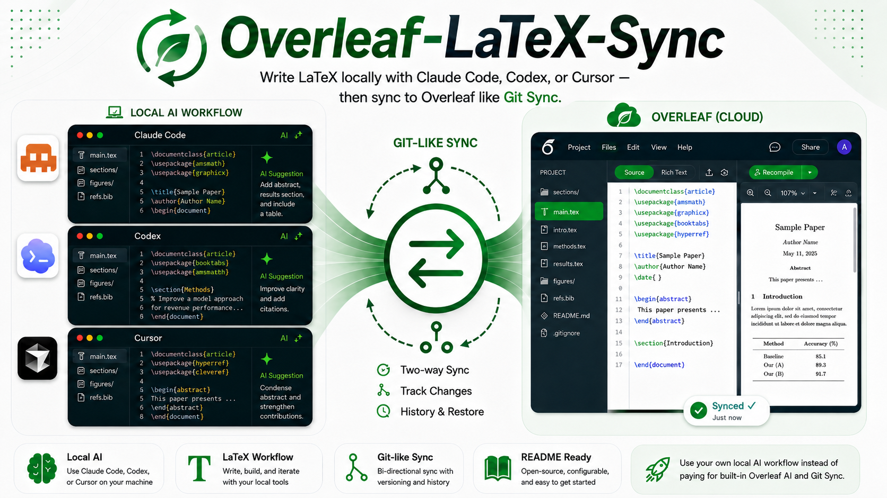

# Overleaf-LaTeX-Sync · Overleaf Two-Way Sync 

<sub>Title logo: [Overleaf Logo.svg](https://commons.wikimedia.org/wiki/File:Overleaf_Logo.svg) on Wikimedia Commons — © Overleaf, [CC BY 2.5](https://creativecommons.org/licenses/by/2.5/). *This project is not affiliated with Overleaf; see [Disclaimer](#disclaimer).*</sub>  

**Overleaf-LaTeX-Sync:** write LaTeX locally with **Claude Code**, **Codex**, **Cursor**, or any editor — then sync to [Overleaf](https://www.overleaf.com) in a workflow similar to **Git-style two-way sync** (no need for Overleaf’s paid in-browser AI or hosted Git integrations for this path).

<div align="center">

[](LICENSE)
[](https://www.python.org/)
[](https://www.latex-project.org/)
[](https://www.overleaf.com/)

[](https://wiki.qt.io/Qt_for_Python)
[](https://click.palletsprojects.com/)
[](https://socket.io/)
[](https://requests.readthedocs.io/)

[](#requirements)
[](#contributing)
[](https://github.com/moritzgloeckl/overleaf-sync)

</div>



## ✨ Why local AI + this tool

- **Paid features elsewhere:** Overleaf often bundles **built-in AI** and **Git–Overleaf** style sync behind **paid** plans. This project does **not** replace Overleaf products; it is an **MIT-licensed** helper so you use a **free Overleaf tier** plus **your own machine**.
- **Your stack:** Edit `.tex` and assets with **your** AI tools and repos (e.g. local Git next to your files). Collaborators can keep using Overleaf in the browser.
- **Two-way mirror:** Pull remote snapshots down, reconcile locally (including with Git), then push changes back via the sync commands below.

**中文摘要：** Overleaf 上的内置 **AI** 与 **Git 同步**通常为 **付费功能**。本项目让你在本地使用 **Claude Code / Codex / Cursor** 等工具编写 LaTeX，再将工作区 **双向同步** 到 Overleaf，节奏接近 Git 协作；请以 [Overleaf 官方条款](https://www.overleaf.com) 为准。

---

## 📂 Repository layout

```text
.
├── LICENSE                # MIT
├── README.md              # This file
├── pyproject.toml         # Flit metadata (targets PyPI package name "overleaf-sync"; nested layout → prefer install via olsync/ below)
├── requirements.txt       # Pinned-ish deps for olsync (SaaS) dev install
├── image/
│   └── overleaf-latex-sync.png   # Promo / architecture diagram (add to commits if missing locally)
├── olsync/                # Hosted Overleaf SaaS (**www.overleaf.com**)
│   ├── setup.py           # setuptools: install editable from this folder
│   └── olsync/
│       ├── __init__.py
│       ├── olclient.py    # HTTP API, Socket.IO (project tree), upload/delete/compile helpers
│       ├── olbrowserlogin.py   # Embedded browser login; persists cookie (+ GCLB fix in this fork)
│       └── olsync.py      # Click CLI: login, list, download (PDF), default two-way sync
└── olcesync/              # Sync with **self-hosted Overleaf Community Edition**
    ├── requirements.txt
    ├── setup.py
    └── olcesync/
        ├── comm.py        # Shared JS / cookie names for CE
        ├── olclient.py    # Same ideas as olsync; uses server IP, optional TLS verify off
        ├── olbrowserlogin.py
        └── olsync.py      # CLI: login requires `-s/--server_ip`, etc.
```

- **`olsync`** — Targets **https://www.overleaf.com** (fixed host in `olclient.py` / `olbrowserlogin.py`).
- **`olcesync`** — Targets an **HTTPS** instance you host; login takes **`-s <host-or-IP>`** (see `--help` after install).

---

## ⚡ Features (both tracks, where applicable)

| Capability | Notes |
|------------|------|
| **Login** | Opens **PySide6** WebEngine onto the real login page (CAPTCHA-safe path). Saves **cookie** to `.olauth` (not your password). Accept **all cookies** in the banner when prompted. |
| **List projects** | `… list` — prints projects from dashboard metadata. |
| **Two-way sync** | Default command (no subcommand): download ZIP, mirror **remote ↔ local** with prompts on conflicts/deletes. |
| **`-l` / `-r`** | Local-only (`-l`) or remote-only (`-r`) sync; useful with Git on your side. |
| **`-n`** / **`.olproject_name`** | Map local folder ↔ Overleaf **display name** (spaces allowed in name file). Order: `-n` → `.olproject_name` → current directory name. |
| **PDF** | `… download` — compile-and-fetch PDF (saas `olsync` only flow in this repo’s CE tree may differ; CE users should verify CE routes). |
| **Ignore list** | Optional **`.olignore`** (fnmatch patterns; not identical to `.gitignore`). |

---

## 📋 Requirements

- **Python 3** (3.10–3.12 recommended; **3.13** works with a **newer PySide6** — see below).
- **PySide6** (Qt WebEngine for login).
- **socketIO-client**, **requests**, **beautifulsoup4**, **click**, **yaspin**, **python-dateutil**.

**Python 3.13:** `requirements.txt` pins `PySide6==6.5.0`, which may **not** install on 3.13. Use e.g. `PySide6>=6.8.2` instead.

---

## 📦 Install from source (recommended for this repo)

### A. `olsync` — hosted Overleaf (overleaf.com)

```bash
cd /path/to/overleaf-sync
python -m venv .venv
# Windows: .venv\Scripts\activate
# macOS/Linux: source .venv/bin/activate
python -m pip install -U pip
python -m pip install -r requirements.txt
# If PySide6 fails on 3.13:
#   python -m pip install "PySide6>=6.8.2"
python -m pip install -e ./olsync
```

Run the CLI (setuptools `setup.py` here may **not** register the `ols` console script — use the module form):

```bash
python -m olsync.olsync login
python -m olsync.olsync list
python -m olsync.olsync              # two-way sync
python -m olsync.olsync -l           # push local → Overleaf only
python -m olsync.olsync -r           # pull Overleaf → local only
python -m olsync.olsync -n "My Project Name"
python -m olsync.olsync -v           # verbose tracebacks
```

If `pip install` from **repository root** via Flit fails (`pyproject.toml` expects a flat `olsync/` module path), **always install from `./olsync`** as above.

**Upstream PyPI (different code / may lag this repo):** [`pip install overleaf-sync`](https://pypi.org/project/overleaf-sync/) from [moritzgloeckl/overleaf-sync](https://github.com/moritzgloeckl/overleaf-sync); that path may install an `ols` entry point but can be **out of date** versus current overleaf.com behaviour.

### B. `olcesync` — Overleaf Community Edition (self-hosted)

```bash
python -m pip install -r olcesync/requirements.txt
python -m pip install -e ./olcesync
python -m olcesync.olsync --help    # login: -s / --server_ip required
```

---

## 🔄 Typical workflow with Git locally

1. Create the project on Overleaf first (this tool does **not** create projects).
2. Clone/open a folder on disk; optionally `git init` and commit as usual.
3. `python -m olsync.olsync login` → creates **`.olauth`** in the current directory (never commit secrets — see `.gitignore`).
4. Put the exact Overleaf title in **`.olproject_name`** one line or pass **`-n "…"`**.
5. `python -m olsync.olsync` or `-l`/`-r` after editing locally.

---

## 🔒 Security & hygiene

- **`.olauth`** is a login **session** equivalent — treat like a password; already listed in `.gitignore`.
- You only authenticate on **official** Overleaf (saas) pages inside the embedded browser.

---

## ⚠️ Known limitations

- After editing on Overleaf’s web UI, wait **about 1–2 minutes** before syncing or changes may look stale ([original note](https://github.com/moritzgloeckl/overleaf-sync)).
- This software is **not** affiliated with Overleaf (see Disclaimer below).

---

## 🤝 Contributing

Pull requests and issues are welcome — especially fixes for evolving Overleaf HTML / Socket APIs.

## ⚖️ Disclaimer

THE AUTHOR OF THIS SOFTWARE AND THIS SOFTWARE IS NOT ENDORSED BY, DIRECTLY AFFILIATED WITH, MAINTAINED, AUTHORIZED, OR SPONSORED BY OVERLEAF OR WRITELATEX LIMITED. ALL PRODUCT AND COMPANY NAMES ARE THE REGISTERED TRADEMARKS OF THEIR ORIGINAL OWNERS. THE USE OF ANY TRADE NAME OR TRADEMARK IS FOR IDENTIFICATION AND REFERENCE PURPOSES ONLY AND DOES NOT IMPLY ANY ASSOCIATION WITH THE TRADEMARK HOLDER OF THEIR PRODUCT BRAND.

THIS SOFTWARE IS PROVIDED BY THE COPYRIGHT HOLDERS AND CONTRIBUTORS "AS IS" AND ANY EXPRESS OR IMPLIED WARRANTIES, INCLUDING, BUT NOT LIMITED TO, THE IMPLIED WARRANTIES OF MERCHANTABILITY AND FITNESS FOR A PARTICULAR PURPOSE ARE DISCLAIMED. IN NO EVENT SHALL THE COPYRIGHT OWNER OR CONTRIBUTORS BE LIABLE FOR ANY DIRECT, INDIRECT, INCIDENTAL, SPECIAL, EXEMPLARY, OR CONSEQUENTIAL DAMAGES (INCLUDING, BUT NOT LIMITED TO, PROCUREMENT OF SUBSTITUTE GOODS OR SERVICES; LOSS OF USE, DATA, OR PROFITS; OR BUSINESS INTERRUPTION) HOWEVER CAUSED AND ON ANY THEORY OF LIABILITY, WHETHER IN CONTRACT, STRICT LIABILITY, OR TORT (INCLUDING NEGLIGENCE OR OTHERWISE) ARISING IN ANY WAY OUT OF THE USE OF THIS SOFTWARE, EVEN IF ADVISED OF THE POSSIBILITY OF SUCH DAMAGE.

THIS SOFTWARE WAS DESIGNED TO BE USED ONLY FOR RESEARCH PURPOSES. THIS SOFTWARE COMES WITH NO WARRANTIES OF ANY KIND WHATSOEVER. USE IT AT YOUR OWN RISK! IF THESE TERMS ARE NOT ACCEPTABLE, YOU AREN'T ALLOWED TO USE THE CODE.

## 🔗 Upstream

Initial project source: [https://github.com/moritzgloeckl/overleaf-sync.git](https://github.com/moritzgloeckl/overleaf-sync.git)
